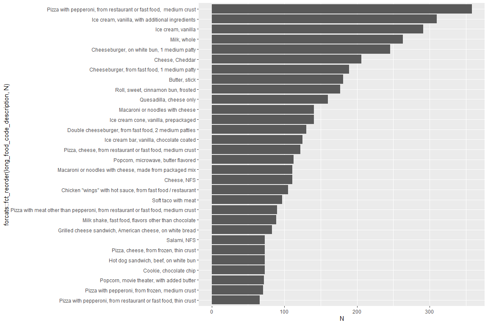

PM566 Midterm Project
================
Flemming Wu
2022-10-16

Main source of data:

<https://www.ars.usda.gov/northeast-area/beltsville-md-bhnrc/beltsville-human-nutrition-research-center/food-surveys-research-group/docs/wweia-documentation-and-data-sets/>

Questions:  
Insulin resistance and diabetes is a growing health issue for Americans.
When foods with a high glycemic index (causing a rapid rise in blood
sugar) are consumed, the pancreas must pump insulin to move sugar from
the blood back into the cells. Over time, if these foods are constantly
consumed, the cells stop responding to insulin and the normal blood
sugar level rises. This leads to weight gain, as excess blood sugar is
sent to be stored as body fat, and sets the stage for prediabetes and
type 2 diabetes.  

Some quick factoids about diabetes from the CDC:  
\* More than 37 million people in the United States have diabetes, and 1
in 5 of them don’t know they have it.  
\* 96 million US adults—over a third—have prediabetes, and more than 8
in 10 of them don’t know they have it.  
\* Diabetes is the 7th leading cause of death in the United States (and
may be underreported).  

While there are many other factors outside of diet that influence the
development of insulin resistance and diabetes such as lifestyle,
environmental factors, and family history, in this project, I will be
investigating factors affecting our food choices using the NHANES
(National Health and Nutrition Examination Survey) data. More
specifically, I examined the data that was collected in What We Eat in
America (WWEIA), the dietary interview component of the NHANES.  
I also acknowledge that people’s dietary requirements vary due to a
variety of factors, but according to the CDC and various other sources,
people should generally be wary of continued consumption of foods high
in added sugar and saturated fats. Therefore, in this project, I will
use the data to investigate the following questions that I have asked:  

-   What time and/or day of the week do people generally eat foods high
    in sugar or saturated fatty acids (fa)?
-   Does sugar or saturated fa consumption vary by age, ethnicity, or
    gender?
-   Does the source of food or whether the meal was eaten at home have
    an effect on sugar or saturated fa consumption?
-   Finally, what specific food items are associated with high amounts
    of sugar or saturated fa?

### Preliminary Results

Summary tables

| Day of Food Intake | Average Total Sugar Consumption | Standard Deviation of Total Sugar Consumption | Average Total Saturated Fatty Acid Consumption | Standard Deviation of Total Saturated Fatty Acid Consumption | Number of Observations |
|:-------------------|--------------------------------:|----------------------------------------------:|-----------------------------------------------:|-------------------------------------------------------------:|-----------------------:|
| Sunday             |                        7.483360 |                                      14.86044 |                                       1.955798 |                                                     3.892107 |                  54218 |
| Monday             |                        7.320907 |                                      14.24324 |                                       1.845215 |                                                     3.665864 |                  36324 |
| Tuesday            |                        7.157184 |                                      13.27854 |                                       1.787949 |                                                     3.718271 |                  43947 |
| Wednesday          |                        7.363126 |                                      14.53861 |                                       1.857555 |                                                     3.696024 |                  37349 |
| Thursday           |                        7.345880 |                                      13.93046 |                                       1.850386 |                                                     3.614566 |                  34140 |
| Friday             |                        7.559111 |                                      14.53974 |                                       1.889003 |                                                     3.783606 |                  59349 |
| Saturday           |                        7.837789 |                                      15.18268 |                                       2.022816 |                                                     3.979325 |                  45145 |

From the summary table above, it can be observed that average sugar and
saturated fat consumption is slightly higher on the weekends, and are
closely followed by Friday and Wednesday.

| Hour of the Day (0 = 12:00 AM - 12:59 AM, 23 = 11:00 PM - 11:59 PM) | Average Total Sugar Consumption | Standard Deviation of Total Sugar Consumption | Average Total Saturated Fatty Acid Consumption | Standard Deviation of Total Saturated Fatty Acid Consumption | Number of Observations |
|--------------------------------------------------------------------:|--------------------------------:|----------------------------------------------:|-----------------------------------------------:|-------------------------------------------------------------:|-----------------------:|
|                                                                   0 |                        9.281177 |                                      19.60014 |                                       2.020862 |                                                     4.572683 |                    756 |
|                                                                   1 |                        9.694039 |                                      17.09816 |                                       2.479929 |                                                     6.265952 |                    619 |
|                                                                   2 |                        9.538283 |                                      17.58972 |                                       1.811527 |                                                     4.149922 |                    565 |
|                                                                   3 |                        6.959501 |                                      11.08451 |                                       1.353719 |                                                     2.599288 |                    581 |
|                                                                   4 |                        7.605092 |                                      20.71466 |                                       1.246757 |                                                     2.708958 |                    925 |
|                                                                   5 |                        7.346756 |                                      14.84793 |                                       1.283616 |                                                     2.855724 |                   2352 |
|                                                                   6 |                        7.102939 |                                      13.54264 |                                       1.324016 |                                                     2.905619 |                   6986 |
|                                                                   7 |                        7.400253 |                                      13.39447 |                                       1.377798 |                                                     2.950462 |                  15717 |
|                                                                   8 |                        7.237313 |                                      13.13087 |                                       1.434266 |                                                     2.743565 |                  19786 |
|                                                                   9 |                        7.784289 |                                      15.84829 |                                       1.563612 |                                                     2.958099 |                  17658 |
|                                                                  10 |                        8.244832 |                                      16.14223 |                                       1.652461 |                                                     3.500670 |                  15098 |
|                                                                  11 |                        7.283378 |                                      13.79503 |                                       1.742881 |                                                     3.307783 |                  18864 |
|                                                                  12 |                        6.574238 |                                      14.01575 |                                       1.827410 |                                                     3.584371 |                  30530 |
|                                                                  13 |                        6.751445 |                                      14.45848 |                                       1.848050 |                                                     3.646379 |                  19739 |
|                                                                  14 |                        7.729329 |                                      14.18067 |                                       1.807012 |                                                     3.522439 |                  15133 |
|                                                                  15 |                        8.263870 |                                      14.59720 |                                       1.837134 |                                                     3.786577 |                  14347 |
|                                                                  16 |                        8.120186 |                                      14.92500 |                                       1.988495 |                                                     4.207585 |                  13846 |
|                                                                  17 |                        6.826429 |                                      13.53174 |                                       2.120508 |                                                     4.214567 |                  20473 |
|                                                                  18 |                        6.385170 |                                      12.90815 |                                       2.119829 |                                                     4.050218 |                  28778 |
|                                                                  19 |                        7.091154 |                                      13.54769 |                                       2.281633 |                                                     4.444892 |                  25382 |
|                                                                  20 |                        8.213035 |                                      15.17395 |                                       2.286814 |                                                     4.184573 |                  19375 |
|                                                                  21 |                        9.185261 |                                      16.53200 |                                       2.405327 |                                                     4.580577 |                  12270 |
|                                                                  22 |                        9.665980 |                                      16.74851 |                                       2.302562 |                                                     4.552494 |                   6952 |
|                                                                  23 |                        9.294904 |                                      16.26559 |                                       2.190595 |                                                     4.263733 |                   3740 |

From the summary table above, which groups sugar and saturated fat
consumption by the hours that they were consumed, it can be seen that
higher sugar and saturated fat consumption occurs between the hours of
8PM to 2AM. Additionally, 3PM and 4PM also had slightly higher sugar and
saturated fat consumption.

| Eating Occasion      | Average Total Sugar Consumption | Standard Deviation of Total Sugar Consumption | Average Total Saturated Fatty Acid Consumption | Standard Deviation of Total Saturated Fatty Acid Consumption | Number of Observations |
|:---------------------|--------------------------------:|----------------------------------------------:|-----------------------------------------------:|-------------------------------------------------------------:|-----------------------:|
| Extended consumption |                       13.436427 |                                     47.647936 |                                      0.5461218 |                                                    3.0733234 |                   4055 |
| Bocadillo            |                       10.939804 |                                     14.916228 |                                      1.6517825 |                                                    3.8725720 |                    970 |
| Snack                |                       10.750104 |                                     16.272418 |                                      2.0575753 |                                                    4.1833084 |                  51059 |
| Botana               |                        9.937310 |                                     13.607914 |                                      1.4459681 |                                                    3.3406377 |                    658 |
| Merienda             |                        9.613596 |                                     14.308911 |                                      1.5289266 |                                                    3.6017500 |                   2002 |
| Entre comida         |                        8.560238 |                                     13.975195 |                                      1.2626526 |                                                    3.4659721 |                    757 |
| Tentempie            |                        8.470000 |                                     11.234594 |                                      1.2170746 |                                                    2.3384720 |                     67 |
| Drink                |                        8.152440 |                                     17.147604 |                                      0.3841517 |                                                    1.6429912 |                  15124 |
| Breakfast            |                        7.485156 |                                     11.892042 |                                      1.6379249 |                                                    3.0858678 |                  60030 |
| Brunch               |                        7.447215 |                                     13.132067 |                                      2.2682986 |                                                    4.2733621 |                   2883 |
| Infant feeding       |                        7.272937 |                                      6.152278 |                                      1.5239338 |                                                    1.5788874 |                   6377 |
| Supper               |                        6.679319 |                                     13.988903 |                                      2.4730760 |                                                    4.5440174 |                  14958 |
| Don’t know           |                        6.640000 |                                      8.925135 |                                      0.2628750 |                                                    0.4778241 |                      8 |
| Bebida               |                        6.589553 |                                     14.260117 |                                      0.3179097 |                                                    1.0943956 |                   1141 |
| Cena                 |                        6.513557 |                                     12.368265 |                                      1.8761135 |                                                    4.1969725 |                   5047 |
| Desayano             |                        6.460812 |                                     10.919720 |                                      1.3844203 |                                                    2.6560547 |                   4949 |
| Lunch                |                        6.248207 |                                     12.406239 |                                      1.9671380 |                                                    3.6730096 |                  64280 |
| Dinner               |                        5.989116 |                                     12.520805 |                                      2.3265108 |                                                    4.3121108 |                  68497 |
| Comida               |                        5.699739 |                                     12.081675 |                                      1.8692069 |                                                    4.1190169 |                   3683 |
| Almuerzo             |                        5.591528 |                                     11.998788 |                                      1.7661940 |                                                    3.9230311 |                   3927 |

From the summary table above, we can see that eating occasions that are
more considered to be more formal meals, such as dinner, lunch,
almuerzo, desayano, supper, etc. generally involve less consumption of
sugar than do informal eating occasions such as snacks. The reverse is
true for saturated fatty acid consumption, as the average grams consumed
for these are higher in more formal eating occasions.

| Age Range | Average Total Sugar Consumption | Standard Deviation of Total Sugar Consumption | Average Total Saturated Fatty Acid Consumption | Standard Deviation of Total Saturated Fatty Acid Consumption | Number of Observations |
|:----------|--------------------------------:|----------------------------------------------:|-----------------------------------------------:|-------------------------------------------------------------:|-----------------------:|
| \<1       |                        6.611331 |                                      5.988060 |                                       1.313027 |                                                     1.481287 |                   7764 |
| 1-3       |                        6.215191 |                                      8.714115 |                                       1.321649 |                                                     2.195146 |                  20896 |
| 4-8       |                        7.904546 |                                     11.154596 |                                       1.781008 |                                                     3.093951 |                  26287 |
| 9-13      |                        9.048461 |                                     13.752656 |                                       2.218246 |                                                     3.940427 |                  26180 |
| 14-18     |                        9.805673 |                                     17.177542 |                                       2.602698 |                                                     4.859079 |                  21230 |
| 19-30     |                        8.609990 |                                     16.641643 |                                       2.354458 |                                                     4.596060 |                  31646 |
| 31-50     |                        7.631741 |                                     17.164368 |                                       1.985681 |                                                     4.158158 |                  63552 |
| 51-70     |                        6.588676 |                                     14.137991 |                                       1.709832 |                                                     3.569828 |                  79512 |
| 70+       |                        5.958233 |                                     11.526940 |                                       1.586809 |                                                     3.215835 |                  33405 |

The summary table above shows that average sugar and fatty acid
consumption increases from birth until the ages of 14-18, and then
decreases after age 18.

| Gender | Average Total Sugar Consumption | Standard Deviation of Total Sugar Consumption | Average Total Saturated Fatty Acid Consumption | Standard Deviation of Total Saturated Fatty Acid Consumption | Number of Observations |
|:-------|--------------------------------:|----------------------------------------------:|-----------------------------------------------:|-------------------------------------------------------------:|-----------------------:|
| female |                        6.717594 |                                      12.61024 |                                       1.665175 |                                                     3.310949 |                 159296 |
| male   |                        8.231233 |                                      16.07537 |                                       2.132381 |                                                     4.207429 |                 151176 |

From the table above, it can be seen that males consume higher amounts
of sugar and saturated fatty acids on average.

| Race                        | Average Total Sugar Consumption | Standard Deviation of Total Sugar Consumption | Average Total Saturated Fatty Acid Consumption | Standard Deviation of Total Saturated Fatty Acid Consumption | Number of Observations |
|:----------------------------|--------------------------------:|----------------------------------------------:|-----------------------------------------------:|-------------------------------------------------------------:|-----------------------:|
| other_hispanic              |                        6.914836 |                                      13.80919 |                                       1.654925 |                                                     3.393846 |                  30790 |
| non-hispanic_white          |                        7.666656 |                                      15.22480 |                                       1.985647 |                                                     3.788784 |                 111428 |
| other_race_incl_multiracial |                        8.376941 |                                      16.10486 |                                       2.105553 |                                                     4.321792 |                  19032 |
| non-hispanic_black          |                        8.071349 |                                      15.04903 |                                       1.992225 |                                                     3.962436 |                  78246 |
| mexican_american            |                        7.144258 |                                      12.83065 |                                       1.837305 |                                                     3.921403 |                  39615 |
| non-hispanic_asian          |                        5.524766 |                                      10.58994 |                                       1.488071 |                                                     3.001189 |                  31361 |

The groups with the highest average sugar and saturated fatty acid
consumption are “other race including multiracial” and “non-hispanic
black”, and they are closely followed by “non-hispanic white”.

| Food Source                                  | Average Total Sugar Consumption | Standard Deviation of Total Sugar Consumption | Average Total Saturated Fatty Acid Consumption | Standard Deviation of Total Saturated Fatty Acid Consumption | Number of Observations |
|:---------------------------------------------|--------------------------------:|----------------------------------------------:|-----------------------------------------------:|-------------------------------------------------------------:|-----------------------:|
| Vending machine                              |                       18.710400 |                                     23.458911 |                                      1.1483988 |                                                     2.459972 |                    850 |
| Store - convenience type                     |                       14.030569 |                                     25.085877 |                                      1.6184441 |                                                     3.757934 |                  11189 |
| Fundraiser sales                             |                       12.130064 |                                     14.847390 |                                      3.7416624 |                                                     5.037286 |                    157 |
| Sport, recreation, or entertainment facility |                       10.129223 |                                     18.481386 |                                      4.2918967 |                                                     9.828702 |                    978 |
| Store - no additional info                   |                        9.309326 |                                     15.617598 |                                      2.0333202 |                                                     4.245929 |                    712 |
| Street vendor, vending truck                 |                        8.817625 |                                     16.329607 |                                      2.9820328 |                                                     5.717057 |                    762 |
| Cafeteria in a K-12 school                   |                        8.553312 |                                      9.436188 |                                      1.7444786 |                                                     2.799679 |                   7386 |
| From someone else/gift                       |                        8.123566 |                                     15.009052 |                                      1.9459895 |                                                     3.654022 |                  14397 |
| Community food program - other               |                        7.872614 |                                      8.852538 |                                      1.5809276 |                                                     2.302769 |                    635 |
| Child/Adult home care                        |                        7.515060 |                                     13.821410 |                                      1.7173936 |                                                     3.361009 |                    249 |
| Residential dining facility                  |                        7.416015 |                                     13.096842 |                                      2.1591571 |                                                     3.752216 |                    261 |
| Store - grocery/supermarket                  |                        7.287357 |                                     13.829328 |                                      1.6927075 |                                                     3.479220 |                 214218 |
| Soup kitchen/shelter/food pantry             |                        7.283943 |                                     15.743713 |                                      1.6370935 |                                                     3.156207 |                    246 |
| Restaurant fast food/pizza                   |                        7.251546 |                                     14.462476 |                                      3.2555055 |                                                     5.170879 |                  30116 |
| Community program no additional information  |                        7.230417 |                                     14.687502 |                                      1.4436667 |                                                     2.221191 |                     24 |
| Child/Adult care center                      |                        6.320851 |                                      8.022157 |                                      1.3558262 |                                                     2.241056 |                   1410 |
| Bar/tavern/lounge                            |                        6.225526 |                                     15.539044 |                                      1.7449447 |                                                     3.644319 |                    561 |
| Don’t know                                   |                        5.863581 |                                     11.621968 |                                      1.4536714 |                                                     3.109068 |                    779 |
| Cafeteria NOT in a K-12 school               |                        5.689881 |                                     11.523986 |                                      1.7757091 |                                                     3.233397 |                   2681 |
| Grown or caught by you or someone you know   |                        5.603232 |                                     11.741621 |                                      1.3563009 |                                                     2.676073 |                   1479 |
| Common coffee pot or snack tray              |                        5.229234 |                                     13.021891 |                                      0.7414516 |                                                     2.990588 |                    992 |
| Meals on Wheels                              |                        4.997661 |                                      7.807852 |                                      2.2035848 |                                                     3.658861 |                    171 |
| Restaurant with waiter/waitress              |                        4.964812 |                                     12.479909 |                                      2.2708182 |                                                     4.114634 |                  18771 |
| Mail order purchase                          |                        4.441342 |                                     11.171060 |                                      0.9461021 |                                                     2.549206 |                   1312 |
| Restaurant no additional information         |                        3.889813 |                                      8.113670 |                                      1.6095607 |                                                     3.141210 |                    107 |
| Fish caught by you or someone you know       |                        1.201724 |                                      2.826830 |                                      3.6144483 |                                                     5.195365 |                     29 |

High average sugar consumption can be seen to come from food sources
such as vending machines and convenience stores, likely due to the sale
of sugar-sweetened beverages. High saturated fatty acid consumption can
be seen to come from food sources such as fish (due to naturally
occurring omega fatty acids in fish) as well as fast food restaurants
and recreational facilities.

| Meal Eaten at Home | Average Total Sugar Consumption | Standard Deviation of Total Sugar Consumption | Average Total Saturated Fatty Acid Consumption | Standard Deviation of Total Saturated Fatty Acid Consumption | Number of Observations |
|:-------------------|--------------------------------:|----------------------------------------------:|-----------------------------------------------:|-------------------------------------------------------------:|-----------------------:|
| dont_know          |                        7.961111 |                                      11.69612 |                                       1.612952 |                                                     2.280831 |                     63 |
| no                 |                        7.641902 |                                      14.84321 |                                       1.914405 |                                                     3.780361 |                  90463 |
| yes                |                        7.377446 |                                      14.24498 |                                       1.883808 |                                                     3.782103 |                 219946 |

The table above reveals that food not eaten at home is generally
slightly higher in average sugars and saturated fatty acids.

### Data Visualization

#### What time and/or day of the week do people generally eat foods high in sugar/saturated fats?

The plots above reveal that average sugar consumption increases as the
day progresses, with large spikes at around 4:00 PM, 6:00 PM, 9:00 PM
and 4:00 AM. A similar trend can be observed for saturated fatty acid
consumption, with a large spike at around 12:00 PM and 10:30 PM.

The plots above reveal that sugar consumption is higher towards the
evening for Monday through Wednesday. Additionally, there are spikes in
sugar consumption in the morning around 9:30 AM on Wednesday and 5:30 AM
on Thursday. Averages for sugar consumption tend to be more consistent
throughout the 24 hour period on Friday, Saturday, and Sunday.  
Averages for saturated fatty acid consumption are generally more
consistent than sugar consumption, but there is an interesting large
spike in consumption towards the end of the day on Wednesday. It can
also be noted that there are more spikes in saturated fatty acid
consumption on Saturday and Sunday.

The plots above reveal that average sugar consumption is lowest in meals
eaten later in the day such as lunch and dinner, increases for earlier
meals such as breakfast or brunch, and is highest in the snack and
extended consumption categories. For average saturated fatty acid
consumption, the trend can be described as an increase in consumption
with more formal meal categories, such as brunch, dinner, and supper.
However, snacking is also associated with higher average saturated fatty
acid consumption. As expected, bebida, or drinks, are associated with
the lowest saturated fatty acid consumption.

#### Does sugar / saturated fatty acid consumption vary by age, ethnicity, gender?

**need to average observations for people that had recordings in day 1
and day 2**

The violin plots above reveal several trends in average sugar and
saturated fatty acid consumption: first, that consumption is higher on
average for males than females. Secondly, the trend in average
consumption increases until age 18, and then decreases with age. Lastly,
the range of values tends to increase with increasing age, especially so
for males.

In grouping average sugar and saturated fatty acid consumption by
ethnicity, there is not much variation between ethnicity groups and
sugar consumption, however, the lowest average sugar and saturated fatty
acid consumption and range of values is lowest in the non hispanic asian
group, and highest in non hispanic black group.

#### Does the source of the food or whether the meal was eaten at home have an effect?

The plots above graph the log normalized distribution of sugar and
saturated fatty acid in foods eaten at home, not at home and unknown. It
can be seen that the distributions of foods eaten at home and not at
home are essentially the same for both sugar and saturated fatty acids.

<!-- -->

    ## [1] 0.5577345

#### What foods are associated with high sugar or high saturated fatty acids?

    ##   95% 
    ## 33.11

    ##      0%      5%     10%     15%     20%     25%     30%     35%     40%     45% 
    ##   0.000   0.000   0.000   0.000   0.002   0.006   0.013   0.031   0.071   0.178 
    ##     50%     55%     60%     65%     70%     75%     80%     85%     90%     95% 
    ##   0.362   0.572   0.892   1.246   1.646   2.205   2.948   3.893   5.458   8.511 
    ##    100% 
    ## 160.279

    ##   95% 
    ## 8.511

#### Preliminary Conclusions

From the variables that I have investigated in this project, it appears
that

#### Sources

-   <https://www.cdc.gov/diabetes/index.html>
