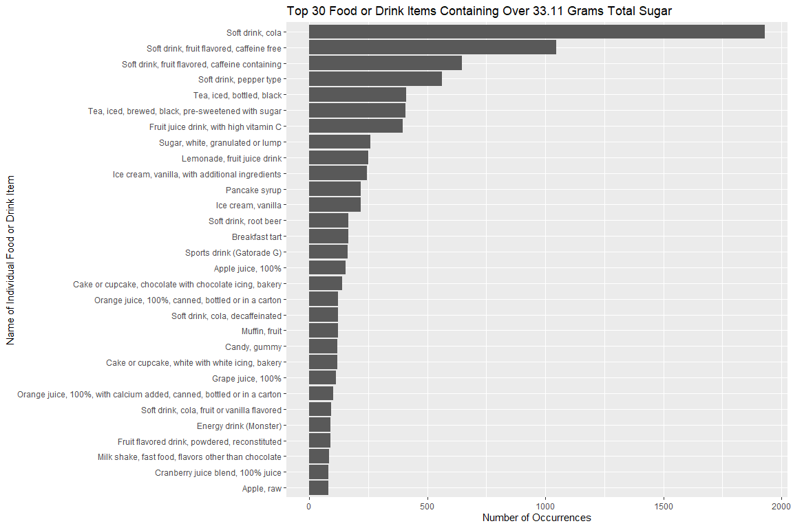
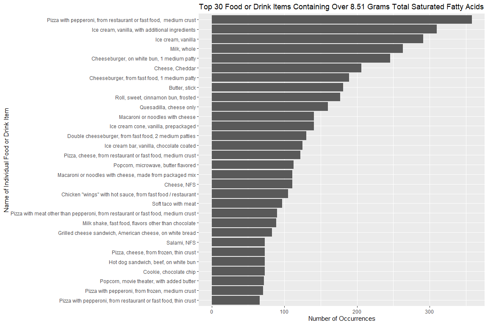

PM566 Midterm Project
================
Flemming Wu
2022-10-21

# Introduction

Insulin resistance and diabetes is a growing health issue for Americans.
When foods with a high glycemic index (causing a rapid rise in blood
sugar) are consumed, the pancreas must pump insulin to move sugar from
the blood back into the cells. Over time, if these foods are consumed on
a consistent basis, cells stop responding to insulin and the normal
blood sugar level rises. This leads to weight gain, as excess blood
sugar is sent to be stored as body fat, and sets the stage for
prediabetes and type 2 diabetes.  

While there are many other factors outside of diet that influence the
development of insulin resistance and diabetes such as lifestyle,
environmental factors, and family history, in this project, I will be
investigating factors affecting our food choices using the NHANES
(National Health and Nutrition Examination Survey) data. More
specifically, I examined the data that was collected in [What We Eat in
America
(WWEIA)](https://www.ars.usda.gov/northeast-area/beltsville-md-bhnrc/beltsville-human-nutrition-research-center/food-surveys-research-group/docs/wweia-documentation-and-data-sets/),
the dietary interview component of the NHANES.  

I also acknowledge that people’s dietary requirements vary due to a
variety of factors, but according to the CDC and other sources, people
should generally be wary of continued consumption of foods high in added
sugar and saturated fats. Therefore, in this project, I will use the
data to investigate the following questions that I have asked:  

1.  **What time and/or day of the week do people generally eat foods
    high in sugar or saturated fatty acids (fa)?**
2.  **Does sugar or saturated fa consumption vary by age, ethnicity, or
    gender?**
3.  **Does the source of food or whether the meal was eaten at home have
    an effect on sugar or saturated fa consumption?**
4.  **Finally, what specific food items are associated with high amounts
    of sugar or saturated fa?**

##### About the data

I used a total of four data sets for my project. The first two are
answers to a food survey questionnaire, in which the respondents were
asked to recall all food and drink they consumed in a 24 hour period.
These questions were asked one two different days, with day one answers
being one table and day two answers being the other table. Not all
respondents were recorded in both days. Observations, or rows, in the
food survey data are separated into individual food or drink items and
also includes estimates on how much of each item was consumed, as well
as energy and nutrient estimates for each item. Participants were asked
additional questions about their consumption, such as what time the item
was consumed, what meal it was a part of, whether the meal was eaten at
home, etc. The next data set I used contains general demographic
information about each of the participants, such as age, gender,
ethnicity, etc. The last data set I used contains descriptions of food
information. Since the food items in the food survey questionnaires were
encoded as numbers, I used this table to cross-reference the food code
numbers with descriptions of the food or drink items.

------------------------------------------------------------------------

# Methods

The data provided on the website were in SAS Transport File Format, so I
used the `haven` package to read in the data directly from the http
link. Once I read in the data into R, I noticed that the column names
were encoded with names that weren’t intuitive such as “WTDRD1PP”, but
the data sets also contained column labels which explained the meanings
of the column names. I did some text processing on the labels, such as
removing non-alphanumeric characters and removing spaces, and then set
these as the column names to make downstream work easier. I then noticed
that all of the categorical variables in the data were encoded with
numbers, such as a 1 for yes or a 2 for no. To fix this, I went through
the data set
[documentation](https://wwwn.cdc.gov/NCHS/nhanes/2017-2018/P_DR2IFF.htm)
and updated the categorical observations with their actual character
values. I then added a column to each of the food survey data tables to
keep track of which day the answers were from, concatenated the data
from day 1 and day 2. Lastly, I merged all of the data into one data
table, using the respondent id numbers and food code numbers as the
common keys.

------------------------------------------------------------------------

# Preliminary Results

##### Summary Tables

| Day of Food Intake | Average Total Sugar Consumption (grams) | Standard Deviation of Total Sugar Consumption | Average Total Saturated Fatty Acid Consumption (grams) | Standard Deviation of Total Saturated Fatty Acid Consumption | Number of Observations |
|:-------------------|----------------------------------------:|----------------------------------------------:|-------------------------------------------------------:|-------------------------------------------------------------:|-----------------------:|
| Sunday             |                                   7.483 |                                        14.860 |                                                  1.956 |                                                        3.892 |                  54218 |
| Monday             |                                   7.321 |                                        14.243 |                                                  1.845 |                                                        3.666 |                  36324 |
| Tuesday            |                                   7.157 |                                        13.279 |                                                  1.788 |                                                        3.718 |                  43947 |
| Wednesday          |                                   7.363 |                                        14.539 |                                                  1.858 |                                                        3.696 |                  37349 |
| Thursday           |                                   7.346 |                                        13.930 |                                                  1.850 |                                                        3.615 |                  34140 |
| Friday             |                                   7.559 |                                        14.540 |                                                  1.889 |                                                        3.784 |                  59349 |
| Saturday           |                                   7.838 |                                        15.183 |                                                  2.023 |                                                        3.979 |                  45145 |

Average sugar and saturated fat consumption appears to be highest on
Friday, Saturday, and Sunday. Tuesday is the day with the lowest average
sugar and saturated fat consumption.

| Hour of the Day (0 = 12:00 AM - 12:59 AM, 23 = 11:00 PM - 11:59 PM) | Average Total Sugar Consumption (grams) | Standard Deviation of Total Sugar Consumption | Average Total Saturated Fatty Acid Consumption (grams) | Standard Deviation of Total Saturated Fatty Acid Consumption | Number of Observations |
|--------------------------------------------------------------------:|----------------------------------------:|----------------------------------------------:|-------------------------------------------------------:|-------------------------------------------------------------:|-----------------------:|
|                                                                   0 |                                   9.281 |                                        19.600 |                                                  2.021 |                                                        4.573 |                    756 |
|                                                                   1 |                                   9.694 |                                        17.098 |                                                  2.480 |                                                        6.266 |                    619 |
|                                                                   2 |                                   9.538 |                                        17.590 |                                                  1.812 |                                                        4.150 |                    565 |
|                                                                   3 |                                   6.960 |                                        11.085 |                                                  1.354 |                                                        2.599 |                    581 |
|                                                                   4 |                                   7.605 |                                        20.715 |                                                  1.247 |                                                        2.709 |                    925 |
|                                                                   5 |                                   7.347 |                                        14.848 |                                                  1.284 |                                                        2.856 |                   2352 |
|                                                                   6 |                                   7.103 |                                        13.543 |                                                  1.324 |                                                        2.906 |                   6986 |
|                                                                   7 |                                   7.400 |                                        13.394 |                                                  1.378 |                                                        2.950 |                  15717 |
|                                                                   8 |                                   7.237 |                                        13.131 |                                                  1.434 |                                                        2.744 |                  19786 |
|                                                                   9 |                                   7.784 |                                        15.848 |                                                  1.564 |                                                        2.958 |                  17658 |
|                                                                  10 |                                   8.245 |                                        16.142 |                                                  1.652 |                                                        3.501 |                  15098 |
|                                                                  11 |                                   7.283 |                                        13.795 |                                                  1.743 |                                                        3.308 |                  18864 |
|                                                                  12 |                                   6.574 |                                        14.016 |                                                  1.827 |                                                        3.584 |                  30530 |
|                                                                  13 |                                   6.751 |                                        14.458 |                                                  1.848 |                                                        3.646 |                  19739 |
|                                                                  14 |                                   7.729 |                                        14.181 |                                                  1.807 |                                                        3.522 |                  15133 |
|                                                                  15 |                                   8.264 |                                        14.597 |                                                  1.837 |                                                        3.787 |                  14347 |
|                                                                  16 |                                   8.120 |                                        14.925 |                                                  1.988 |                                                        4.208 |                  13846 |
|                                                                  17 |                                   6.826 |                                        13.532 |                                                  2.121 |                                                        4.215 |                  20473 |
|                                                                  18 |                                   6.385 |                                        12.908 |                                                  2.120 |                                                        4.050 |                  28778 |
|                                                                  19 |                                   7.091 |                                        13.548 |                                                  2.282 |                                                        4.445 |                  25382 |
|                                                                  20 |                                   8.213 |                                        15.174 |                                                  2.287 |                                                        4.185 |                  19375 |
|                                                                  21 |                                   9.185 |                                        16.532 |                                                  2.405 |                                                        4.581 |                  12270 |
|                                                                  22 |                                   9.666 |                                        16.749 |                                                  2.303 |                                                        4.552 |                   6952 |
|                                                                  23 |                                   9.295 |                                        16.266 |                                                  2.191 |                                                        4.264 |                   3740 |

The table above looks at hourly average sugar and saturated fat
consumption, with 0 corresponding to all items consumed between 12:00 AM
and 12:59 PM, 1 corresponding to all items consumed between 1:00 AM and
1:59 AM, etc. It appears that average sugar and saturated fat
consumption is highest between the hours of 8:00 PM and 3:00 AM.

| Eating Occasion      | Average Total Sugar Consumption (grams) | Standard Deviation of Total Sugar Consumption | Average Total Saturated Fatty Acid Consumption (grams) | Standard Deviation of Total Saturated Fatty Acid Consumption | Number of Observations |
|:---------------------|----------------------------------------:|----------------------------------------------:|-------------------------------------------------------:|-------------------------------------------------------------:|-----------------------:|
| Extended consumption |                                  13.436 |                                        47.648 |                                                  0.546 |                                                        3.073 |                   4055 |
| Bocadillo (snack)    |                                  10.940 |                                        14.916 |                                                  1.652 |                                                        3.873 |                    970 |
| Snack                |                                  10.750 |                                        16.272 |                                                  2.058 |                                                        4.183 |                  51059 |
| Botana (snack)       |                                   9.937 |                                        13.608 |                                                  1.446 |                                                        3.341 |                    658 |
| Merienda (snack)     |                                   9.614 |                                        14.309 |                                                  1.529 |                                                        3.602 |                   2002 |
| Entre comida (snack) |                                   8.560 |                                        13.975 |                                                  1.263 |                                                        3.466 |                    757 |
| Tentempie (snack)    |                                   8.470 |                                        11.235 |                                                  1.217 |                                                        2.338 |                     67 |
| Drink                |                                   8.152 |                                        17.148 |                                                  0.384 |                                                        1.643 |                  15124 |
| Breakfast            |                                   7.485 |                                        11.892 |                                                  1.638 |                                                        3.086 |                  60030 |
| Brunch               |                                   7.447 |                                        13.132 |                                                  2.268 |                                                        4.273 |                   2883 |
| Infant feeding       |                                   7.273 |                                         6.152 |                                                  1.524 |                                                        1.579 |                   6377 |
| Supper               |                                   6.679 |                                        13.989 |                                                  2.473 |                                                        4.544 |                  14958 |
| Don’t know           |                                   6.640 |                                         8.925 |                                                  0.263 |                                                        0.478 |                      8 |
| Bebida (drink)       |                                   6.590 |                                        14.260 |                                                  0.318 |                                                        1.094 |                   1141 |
| Cena (dinner)        |                                   6.514 |                                        12.368 |                                                  1.876 |                                                        4.197 |                   5047 |
| Desayano (breakfast) |                                   6.461 |                                        10.920 |                                                  1.384 |                                                        2.656 |                   4949 |
| Lunch                |                                   6.248 |                                        12.406 |                                                  1.967 |                                                        3.673 |                  64280 |
| Dinner               |                                   5.989 |                                        12.521 |                                                  2.327 |                                                        4.312 |                  68497 |
| Comida (lunch)       |                                   5.700 |                                        12.082 |                                                  1.869 |                                                        4.119 |                   3683 |
| Almuerzo (breakfast) |                                   5.592 |                                        11.999 |                                                  1.766 |                                                        3.923 |                   3927 |

Eating occasions that are more considered to be more formal meals, such
as dinner, lunch, almuerzo (breakfast), desayano (breakfast), supper,
etc. generally involve less consumption of sugar than do informal eating
occasions such as snacks (including bocadillo, botana, merienda, entre
comida). The reverse is true for saturated fats consumption, as the
average grams consumed for these are slightly higher in more formal
eating occasions.  
Note: the data I used (2017-2020) did not provide English translations
for Spanish meal names, but they were provided in the 2003-2004 NHANES
data
[documentation](https://wwwn.cdc.gov/Nchs/Nhanes/2003-2004/dr1iff_c.htm#DR1_030Z),
which is what I used for reference in this analysis:

|         |             |             |         |          |          |              |         |           |           |         |
|:--------|:------------|:------------|:--------|:---------|:---------|:-------------|:--------|:----------|:----------|:--------|
| Spanish | Desayano    | Almuerzo    | Comida  | Merienda | Cena     | Entre comida | Botana  | Bocadillo | Tentempie | Bebida  |
| English | (breakfast) | (breakfast) | (lunch) | (snack)  | (dinner) | (snack)      | (snack) | (snack)   | (snack)   | (drink) |

| Age Range | Average Total Sugar Consumption (grams) | Standard Deviation of Total Sugar Consumption | Average Total Saturated Fatty Acid Consumption (grams) | Standard Deviation of Total Saturated Fatty Acid Consumption | Number of Observations |
|:----------|----------------------------------------:|----------------------------------------------:|-------------------------------------------------------:|-------------------------------------------------------------:|-----------------------:|
| \<1       |                                   6.611 |                                         5.988 |                                                  1.313 |                                                        1.481 |                   7764 |
| 1-3       |                                   6.215 |                                         8.714 |                                                  1.322 |                                                        2.195 |                  20896 |
| 4-8       |                                   7.905 |                                        11.155 |                                                  1.781 |                                                        3.094 |                  26287 |
| 9-13      |                                   9.048 |                                        13.753 |                                                  2.218 |                                                        3.940 |                  26180 |
| 14-18     |                                   9.806 |                                        17.178 |                                                  2.603 |                                                        4.859 |                  21230 |
| 19-30     |                                   8.610 |                                        16.642 |                                                  2.354 |                                                        4.596 |                  31646 |
| 31-50     |                                   7.632 |                                        17.164 |                                                  1.986 |                                                        4.158 |                  63552 |
| 51-70     |                                   6.589 |                                        14.138 |                                                  1.710 |                                                        3.570 |                  79512 |
| 70+       |                                   5.958 |                                        11.527 |                                                  1.587 |                                                        3.216 |                  33405 |

Average sugar and saturated fat consumption increases from birth until
the ages of 14-18, and then decreases after age 18.

| Gender | Average Total Sugar Consumption (grams) | Standard Deviation of Total Sugar Consumption | Average Total Saturated Fatty Acid Consumption (grams) | Standard Deviation of Total Saturated Fatty Acid Consumption | Number of Observations |
|:-------|----------------------------------------:|----------------------------------------------:|-------------------------------------------------------:|-------------------------------------------------------------:|-----------------------:|
| female |                                   6.718 |                                        12.610 |                                                  1.665 |                                                        3.311 |                 159296 |
| male   |                                   8.231 |                                        16.075 |                                                  2.132 |                                                        4.207 |                 151176 |

Males consume higher amounts of sugar and saturated fatty acids on
average, which makes sense considering that generally males have larger
bodies than females, requiring them to consume more calories on average.

| Race                        | Average Total Sugar Consumption (grams) | Standard Deviation of Total Sugar Consumption | Average Total Saturated Fatty Acid Consumption (grams) | Standard Deviation of Total Saturated Fatty Acid Consumption | Number of Observations |
|:----------------------------|----------------------------------------:|----------------------------------------------:|-------------------------------------------------------:|-------------------------------------------------------------:|-----------------------:|
| other_hispanic              |                                   6.915 |                                        13.809 |                                                  1.655 |                                                        3.394 |                  30790 |
| non-hispanic_white          |                                   7.667 |                                        15.225 |                                                  1.986 |                                                        3.789 |                 111428 |
| other_race_incl_multiracial |                                   8.377 |                                        16.105 |                                                  2.106 |                                                        4.322 |                  19032 |
| non-hispanic_black          |                                   8.071 |                                        15.049 |                                                  1.992 |                                                        3.962 |                  78246 |
| mexican_american            |                                   7.144 |                                        12.831 |                                                  1.837 |                                                        3.921 |                  39615 |
| non-hispanic_asian          |                                   5.525 |                                        10.590 |                                                  1.488 |                                                        3.001 |                  31361 |

The groups with the highest average sugar and saturated fat consumption
are “other race including multiracial” and “non-hispanic black”, and
they are closely followed by “non-hispanic white”. The “non hispanic
asian” group consumes less sugar and saturated fats on average than
other groups.

| Food Source                                  | Average Total Sugar Consumption (grams) | Standard Deviation of Total Sugar Consumption | Average Total Saturated Fatty Acid Consumption (grams) | Standard Deviation of Total Saturated Fatty Acid Consumption | Number of Observations |
|:---------------------------------------------|----------------------------------------:|----------------------------------------------:|-------------------------------------------------------:|-------------------------------------------------------------:|-----------------------:|
| Vending machine                              |                                  18.710 |                                        23.459 |                                                  1.148 |                                                        2.460 |                    850 |
| Store - convenience type                     |                                  14.031 |                                        25.086 |                                                  1.618 |                                                        3.758 |                  11189 |
| Fundraiser sales                             |                                  12.130 |                                        14.847 |                                                  3.742 |                                                        5.037 |                    157 |
| Sport, recreation, or entertainment facility |                                  10.129 |                                        18.481 |                                                  4.292 |                                                        9.829 |                    978 |
| Store - no additional info                   |                                   9.309 |                                        15.618 |                                                  2.033 |                                                        4.246 |                    712 |
| Street vendor, vending truck                 |                                   8.818 |                                        16.330 |                                                  2.982 |                                                        5.717 |                    762 |
| Cafeteria in a K-12 school                   |                                   8.553 |                                         9.436 |                                                  1.744 |                                                        2.800 |                   7386 |
| From someone else/gift                       |                                   8.124 |                                        15.009 |                                                  1.946 |                                                        3.654 |                  14397 |
| Community food program - other               |                                   7.873 |                                         8.853 |                                                  1.581 |                                                        2.303 |                    635 |
| Child/Adult home care                        |                                   7.515 |                                        13.821 |                                                  1.717 |                                                        3.361 |                    249 |
| Residential dining facility                  |                                   7.416 |                                        13.097 |                                                  2.159 |                                                        3.752 |                    261 |
| Store - grocery/supermarket                  |                                   7.287 |                                        13.829 |                                                  1.693 |                                                        3.479 |                 214218 |
| Soup kitchen/shelter/food pantry             |                                   7.284 |                                        15.744 |                                                  1.637 |                                                        3.156 |                    246 |
| Restaurant fast food/pizza                   |                                   7.252 |                                        14.462 |                                                  3.256 |                                                        5.171 |                  30116 |
| Community program no additional information  |                                   7.230 |                                        14.688 |                                                  1.444 |                                                        2.221 |                     24 |
| Child/Adult care center                      |                                   6.321 |                                         8.022 |                                                  1.356 |                                                        2.241 |                   1410 |
| Bar/tavern/lounge                            |                                   6.226 |                                        15.539 |                                                  1.745 |                                                        3.644 |                    561 |
| Don’t know                                   |                                   5.864 |                                        11.622 |                                                  1.454 |                                                        3.109 |                    779 |
| Cafeteria NOT in a K-12 school               |                                   5.690 |                                        11.524 |                                                  1.776 |                                                        3.233 |                   2681 |
| Grown or caught by you or someone you know   |                                   5.603 |                                        11.742 |                                                  1.356 |                                                        2.676 |                   1479 |
| Common coffee pot or snack tray              |                                   5.229 |                                        13.022 |                                                  0.741 |                                                        2.991 |                    992 |
| Meals on Wheels                              |                                   4.998 |                                         7.808 |                                                  2.204 |                                                        3.659 |                    171 |
| Restaurant with waiter/waitress              |                                   4.965 |                                        12.480 |                                                  2.271 |                                                        4.115 |                  18771 |
| Mail order purchase                          |                                   4.441 |                                        11.171 |                                                  0.946 |                                                        2.549 |                   1312 |
| Restaurant no additional information         |                                   3.890 |                                         8.114 |                                                  1.610 |                                                        3.141 |                    107 |
| Fish caught by you or someone you know       |                                   1.202 |                                         2.827 |                                                  3.614 |                                                        5.195 |                     29 |

High average sugar consumption can be seen to come from food sources
such as vending machines and convenience stores, likely due to the sale
of sugar-sweetened beverages. High saturated fatty acid consumption can
be seen to come from food sources such as fish (likely due to naturally
occurring omega fatty acids in fish) as well as fast food restaurants
and recreational facilities.

| Meal Eaten at Home | Average Total Sugar Consumption (grams) | Standard Deviation of Total Sugar Consumption | Average Total Saturated Fatty Acid Consumption (grams) | Standard Deviation of Total Saturated Fatty Acid Consumption | Number of Observations |
|:-------------------|----------------------------------------:|----------------------------------------------:|-------------------------------------------------------:|-------------------------------------------------------------:|-----------------------:|
| dont_know          |                                   7.961 |                                        11.696 |                                                  1.613 |                                                        2.281 |                     63 |
| no                 |                                   7.642 |                                        14.843 |                                                  1.914 |                                                        3.780 |                  90463 |
| yes                |                                   7.377 |                                        14.245 |                                                  1.884 |                                                        3.782 |                 219946 |

The table above reveals that food not eaten at home is generally
slightly higher in average sugars and saturated fatty acids, however,
the difference is quite small.

###### Figures

###### What time and/or day of the week do people generally eat foods high in sugar or saturated fatty acids (fa)?

Average sugar consumption is high at around midnight on Sunday and
Friday, but low on Monday and Thursday. Then, the lines for each of the
days seem to converge at around 10:00 AM, and increase until the end of
the day. Average saturated fatty acid consumption is high around
midnight on Saturday and Sunday, and lines for all days converge at
around 7:00 AM. From there, the average saturated fatty acid consumption
increases until the end of the day, especially so for Wednesday, which
sees a dramatic spike in average saturated fatty acid consumption after
6:00 PM.

Although eating occasions at different times of the day, such as
breakfast, lunch, and dinner do not see much difference in sugar or
saturated fatty acid consumption, the plots above do reveal that average
sugar consumption is lowest in formal meals such as breakfast, lunch or
dinner. On the other end, snacking occasions typically involve much
higher average sugar consumption. The reverse trend can be seen for
average saturated fa consumption, as snacks are lower on the y-axis than
meals such as lunch or dinner.

#### Does sugar / saturated fatty acid consumption vary by age, ethnicity, gender?

The violin plots above reveal several trends in average sugar and
saturated fatty acid consumption: first, that consumption is higher on
average for males than females. Secondly, the trend in median sugar
consumption increases until ages 14-18, and then remains about
consistent at around 100 grams per day. The trend in median saturated fa
consumption increases until ages 31-50, and then decreases. Lastly, the
range of values tends to increase with increasing age, especially so for
males, made evident by the width of the distributions decreasing with
increasing age.

In plotting the average sugar and saturated fatty acid consumption by
ethnicity and gender, there is not much variation between ethnicity
groups and sugar consumption. However, the lowest median sugar and
saturated fatty acid consumption and range of values is lowest in the
non-hispanic asian group.

#### Does the source of the food or whether the meal was eaten at home have an effect?

The distributions above describe the amount of sugar and saturated fa in
individual food items grouped by whether the item was eaten at home or
not. Food items containing zero sugar or saturated fa were excluded and
the x-axis was log transformed to account for few items having high
amounts of sugar or saturated fa. It can be observed that whether the
food item was consumed at home or not does not have a significant effect
on sugar or saturated fa consumption, as the distributions for “yes” and
“no” are very similar in both plots.

The sources of food in which people obtain the highest amount of sugar
on average include vending machines, convenience stores, and fundraisers
sales, whereas people obtain the lowest amount of sugar on average from
fish, restaurants and mail order purchases. As for saturated fa, people
obtain the highest amounts from recreational facilities, fundraiser
sales, and fish, whereas the lowest amounts are obtained from coffee,
mail order purchase, and vending machines. These results makes sense, as
non-dairy drinks usually do not contain fatty acids, and fish are high
in omega-3 fatty acids.

#### What foods are associated with high sugar or high saturated fatty acids?

It is interesting to see that the top four most common high-sugar
content items are soft-drinks, and that 21 out of 30 of the items are a
type of beverage. For saturated fatty acids, commonly occurring food
items are pizza and dairy products (including ice cream, milkshakes,
cheese, and milk).

#### Preliminary Conclusions

From the variables that I have investigated in this project, it appears
that the eating occasion, source of food, time of consumption, and age
have the greatest association with sugar and saturated fatty acid
consumption. On the other hand, ethnicity and whether the meal was eaten
at home or not do not seem to be associated strongly with sugar or
saturated fatty acid consumption. Overall, people in this data set
consume higher amounts of sugar during snacking occasions and from
sources of food that include vending machines and convenience stores.
Sugar-sweetened beverages seems to be the most common source of high
intake of sugar

  
Moreover, people in the data set consume higher amount of saturated
fatty acids during meals rather than snacks, and from sources of food
that include fundraising events, recreational facilities, and fast food
restaurants. The common foods associated with high saturated fatty acids
include pizza, ice cream, milkshakes, and burgers.

  
Both sugar and saturated fatty acid consumption slightly increase with
age, are slightly higher on Wednesday, Saturday, and Sunday, and are
highest between the hours of 8:00 PM and 3:00 AM.

#### Further Directions

In further analyses it would be interesting to see if any of the
variables that I have suggested to have an association with sugar or
saturated fatty acid consumption are correlated with each other.

#### Sources

-   <https://www.cdc.gov/diabetes/index.html>
